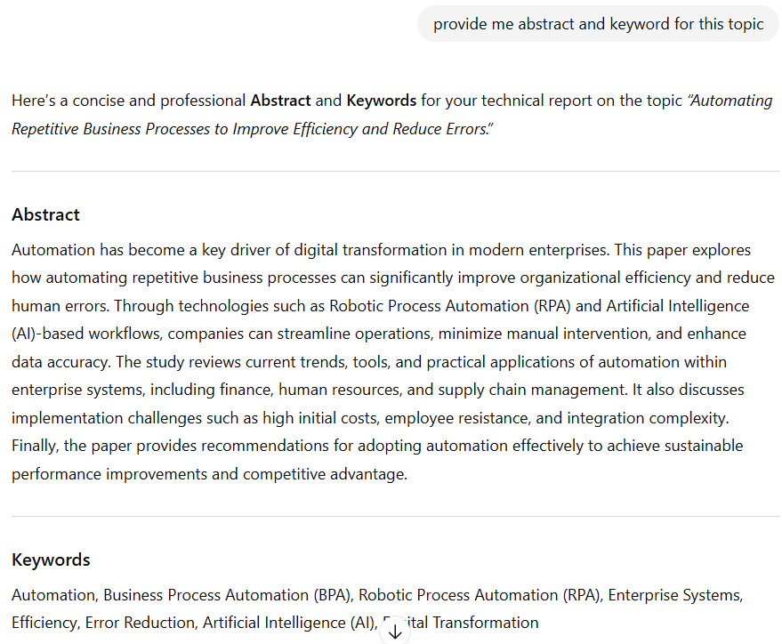
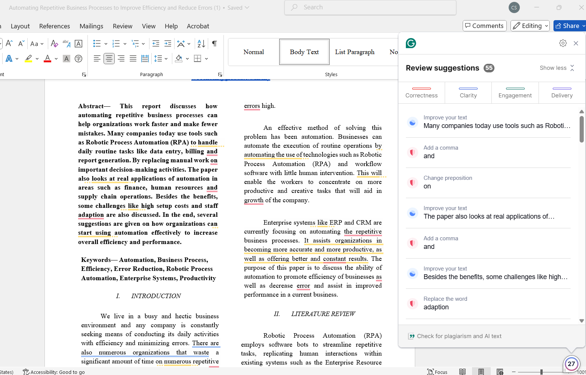

# 📘 Logbook — Technical Report  
**Topic:** Automating Repetitive Business Processes to Improve Efficiency and Reduce Errors  
**Course:** SECP3744 — Enterprise Systems Design & Modelling  
**Repository:** `ESDM_A1_G14`  
**Duration:** 10 Oct 2025 – 26 Oct 2025  
**Author(s):** 
- Sabrina Heng Wei Qi (wei04@graduate.utm.my)  
- Woo Cheng Shuan (wooshuan@graduate.utm.my)

---

## 🗓️ Timeline of Activities 

| Date | Activity Description | Outcome |
|------|----------------------|---------|
| **10 Oct 2025** |  Selected topic and reviewed assignment instructions | Chose Topic 9: *Automating repetitive business processes to improve efficiency and reduce errors* |
| **16 Oct 2025** | Conducted initial background reading on RPA and enterprise systems | Gained understanding of automation relevance in ERP and CRM |
| **17 Oct 2025** | Drafted report outline following technical report template | Outline ready (Introduction → Literature Review → Analysis → Recommendations → Conclusion) |
| **19 Oct 2025** | Collected research materials from UiPath, IBM, and Blue Prism websites | Identified key points on how RPA works |
| **20 Oct 2025** | Wrote abstract and keywords | Completed abstract and keyword section |
| **21 Oct 2025** | Drafted short introduction explaining the need for automation | Introduction finalized |
| **22 Oct 2025** | Wrote literature review summarizing RPA and hyperautomation studies | Section completed with references [5–9] |
| **23 Oct 2025** | Developed analysis and discussion on “How Automation Works” and “Common Use Cases” | Included examples from UiPath, IBM, and Enterprisers Project |
| **24 Oct 2025** | Added advantages and disadvantages sections | Supported by statistics and case data from ResearchGate, Smartflow, and Naviant |
| **25 Oct 2025** | Drafted recommendations and conclusion | Completed report draft and refined structure |
| **26 Oct 2025** | Final proofreading, formatting references, and preparing submission | Final document compiled as PDF and Word file |

---

## 🤖 AI Tools and Usage

| Date | AI Tool Used | Purpose of Use | Verification Method |
|------|---------------|----------------|---------------------|
| 12 Oct | ChatGPT | Helped generate report outline ideas | Checked with assignment template for completeness |
| 13 Oct | ChatGPT | Helped to listed out task division | Reviewed suggested division with team members to ensure fairness and alignment with project scope|
| 15 Oct | ChatGPT | Drafted abstract and keywords | Reviewed and simplified wording manually |
| 24 Oct | ChatGPT | Drafted acknowledgement | Reviewed and simplified wording manually |
| 25 Oct | Grammarly | Checked and corrected grammar, punctuation, and readability across the report | Verified corrections manually to ensure meaning and tone remained accurate |
| 26 Oct | Turnitin | Plagarism Check |Confirmed similarity percentage within acceptable limit|
| 26 Oct | ChatGPT | Created GitHub-style logbook | Manually edited to fit project timeline |

---

## 📸 Appendix Screenshots

Below are selected screenshots that show the use of AI tools, proofreading, and plagiarism checks during the report preparation process.

### 1. ChatGPT Prompt Example

### 2. Grammarly Grammar Check

### 3. Turnitin Similarity Report

